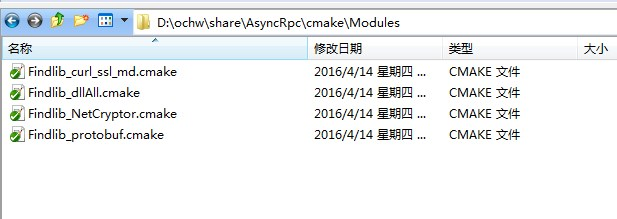

# 查找引用外部库文件
##bqutil
```
include_directories(
. 
./http 
.. 
../commonlibs/dep/include
../commonlibs/dep/include/mysql
../bqutil
)

ADD_DEFINITIONS(-DSTATIC_LIBMONGOCLIENT)
ADD_DEFINITIONS(-DBUILDING_LIBCURL)
ADD_DEFINITIONS(-DDEBUGBUILD)
ADD_DEFINITIONS(-DCURL_STATICLIB)
ADD_DEFINITIONS(-DUSE_OPENSSL)

file(GLOB HEADER_LIST ./*.h)
file(GLOB SRC_LIST ./*.cpp)
file(GLOB_RECURSE httpFiles ./http/*.cpp ./http/*.h)

set(allFiles ${HEADER_LIST} ${SRC_LIST} ${httpFiles})
source_group("include" FILES ${HEADER_LIST})
source_group("source" FILES ${SRC_LIST})
source_group("http" FILES ${httpFiles})
add_library(bqutil STATIC ${allFiles})

#查找自定义库
FIND_PACKAGE(lib_curl_ssl_md REQUIRED)
#标记变量
MARK_AS_ADVANCED(
 LIB_CURLSSL_LIBRARIES
)
#找到，链接
IF(LIB_CURLSSL_LIBRARIES)
MESSAGE(STATUS "Found lib_curl libraries")
TARGET_LINK_LIBRARIES(bqutil ${LIB_CURLSSL_LIBRARIES})
ENDIF (LIB_CURLSSL_LIBRARIES)
```
##link_directories
在多个模块的情况下，可能一个模块的链接依赖於其它模块，例如一个可执行二进制需要链接某些模块，
此时link_directories将有发挥作用。
如在CMakeLists.txt增加：
link_directories(${MyProject_BINARY_DIR}/src/libxxx
${MyProject_BINARY_DIR}/src/libyyy)
将指示CMake在LDFLAGS附加-Lsrc/libxxx -Lsrc/libyyy。  
PS:baidu说此种方法有bug(?未验证)，最好采用find_package,所以我在工程中使用了find_package
##FIND_PACKAGE
- 程序库说明文件  
在项目的根目录中创建目录 cmake/modules/ ，在 cmake/modules/ 下创建文件 FindlibXX.cmake ，
截图如下： 
    

 1.Findlib_cur_ssl_md.cmake  
 
 
 ```
 #输出到cmake_gui页面
 MESSAGE(STATUS "Using bundled Findlibcurld_vc140_x64_openssl_lib_md.cmake...")

if (CMAKE_SYSTEM_NAME MATCHES "Linux")
#查找库路径
FIND_LIBRARY(
 LIB_CURLSSL_LIBRARIES NAMES libcurld_vc140_x64_openssl_lib_md.a
 PATHS ${CMAKE_SOURCE_DIR}/commonLibs/dep/lib/debug
)
elseif (CMAKE_SYSTEM_NAME MATCHES "Windows")
FIND_LIBRARY(
 LIB_CURLSSL_LIBRARIES NAMES libcurld_vc140_x64_openssl_lib_md.lib
 PATHS ${CMAKE_SOURCE_DIR}/commonLibs/dep/lib/debug
)
endif (CMAKE_SYSTEM_NAME MATCHES "Linux") 
```
没使用的程序段
```
#还可以查找头文件，但是因为我include_directories已经包含头文件路径，所以不在查找了
FIND_PATH(
   LIBDB_CXX_INCLUDE_DIR
   db_cxx.h 
   /usr/include/ 
   /usr/local/include/ 
   )
```
2.FIndlib_dllAll.cmake
```
MESSAGE(STATUS "Using bundled Findlib_dllALL.cmake... ")

if (CMAKE_SYSTEM_NAME MATCHES "Linux") 
FIND_LIBRARY(
 LIB_EAY32_LIBRARIES NAMES libeay32.a
 PATHS ${CMAKE_SOURCE_DIR}/commonlibs/dep/dll/x64
)
elseif (CMAKE_SYSTEM_NAME MATCHES "Windows")
FIND_LIBRARY(
 LIB_EAY32_LIBRARIES NAMES libeay32.lib
 PATHS ${CMAKE_SOURCE_DIR}/commonlibs/dep/dll/x64
)
endif (CMAKE_SYSTEM_NAME MATCHES "Linux") 
```
3.Findlib_NetCryptor.cmake
```cmake
MESSAGE(STATUS "Using bundled Findlib_NetCryptor.cmake...")

if (CMAKE_SYSTEM_NAME MATCHES "Linux") 
FIND_LIBRARY(
 LIB_NETCRYPTOR_LIBRARIES NAMES NetCryptor_x64.lib.a
 PATHS ${CMAKE_SOURCE_DIR}/commonLibs/dep/lib/debug
)
elseif (CMAKE_SYSTEM_NAME MATCHES "Windows")
FIND_LIBRARY(
 LIB_NETCRYPTOR_LIBRARIES NAMES NetCryptor_x64.lib
 PATHS ${CMAKE_SOURCE_DIR}/commonLibs/dep/lib/debug
)
endif (CMAKE_SYSTEM_NAME MATCHES "Linux") 
```
4.Findlib_protobuf.cmake
```
MESSAGE(STATUS "Using bundled Findlib_protobuf.cmake...")

if (CMAKE_SYSTEM_NAME MATCHES "Linux") 
FIND_LIBRARY(
 LIB_PROTOBUF_LIBRARIES NAMES libprotobuf_vc14.0_x64_Debug.a
 PATHS ${CMAKE_SOURCE_DIR}/commonLibs/dep/lib/debug
)
elseif (CMAKE_SYSTEM_NAME MATCHES "Windows")
FIND_LIBRARY(
 LIB_PROTOBUF_LIBRARIES NAMES libprotobuf_vc14.0_x64_Debug.lib
 PATHS ${CMAKE_SOURCE_DIR}/commonLibs/dep/lib/debug
)
endif (CMAKE_SYSTEM_NAME MATCHES "Linux") 
```
参考文章链接:  
[在 linux 下使用 CMake 构建应用程序](http://www.ibm.com/developerworks/cn/linux/l-cn-cmake/)
