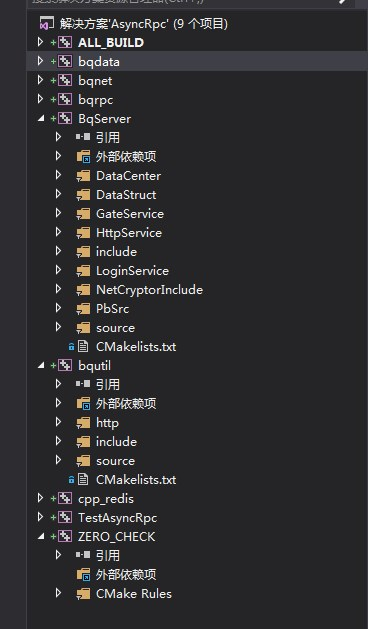

# 编译为内部静态库
##1.bqdata   
CMakelists.txt如下  
```cmake
#包含的头文件
include_directories(
. 
../
../commonlibs/dep/include 
../commonlibs/dep/include/mysql
../bqutil
)
#额外的预处理器
ADD_DEFINITIONS(-DSTATIC_LIBMONGOCLIENT)

#归类查找文件并赋值给变量
#FILE(GLOB var source) 在当前目录下查找
#FILE(GLOB_RECURSE var [RELATIVE path] 包含子文件夹的查找方式
#aux_source_directory(path var) 查找对应路径下所有的文件并赋值给var
FILE(GLOB SRC_LIST ./*.cpp)
FILE(GLOB HEADER_LIST ./*.h)


source_group("Include" FILES ${HEADER_LIST})
source_group("Source" FILES ${SRC_LIST})
#把分散文件合成一个变量
set(allFiles ${HEADER_LIST} ${SRC_LIST})
#编译静态库
#如果编译动态库，如dll或者so,只需要修改STATIC为SHARED
add_library(bqdata STATIC ${allFiles})
```

###source_group(str FILES var)
在vs下生成工程组，
如下图  
  


以下我没有使用，不过比较重要，也记录下来
```
#set_property(TARGET ${lib_name} PROPERTY FOLDER ${ARGV2}) 见下面分析
#set_target_properties(prs PROPERTIES OUTPUT_NAME pr) 见分析
```
###set_property  
在给定的作用域内设置一个命名的属性。

  set_property(<GLOBAL                            |
                DIRECTORY [dir]                   |
                TARGET    [target1 [target2 ...]] |
                SOURCE    [src1 [src2 ...]]       |
                TEST      [test1 [test2 ...]]     |
                CACHE     [entry1 [entry2 ...]]>
               [APPEND]
               PROPERTY <name> [value1 [value2 ...]])

　　为作用域里的0个或多个对象设置一种属性。第一个参数决定了属性可以影响到的作用域。他必须是下述值之一：GLOBAL，全局作用域，唯一，并且不接受名字。
  - DIRECTORY，路径作用域，默认为当前路径，但是也可以用全路径或相对路径指定其他值。
  - TARGET，目标作用域，可以命名0个或多个已有的目标。
  - SOURCE，源作用域，可以命名0个或多个源文件。注意，源文件属性只对加到相同路径（CMakeLists.txt）中的目标是可见的。
  - TEST 测试作用域可以命名0个或多个已有的测试。CACHE作用域必须指定0个或多个cache中已有的条目。  
  - PROPERTY选项是必须的，并且要紧跟在待设置的属性的后面。剩余的参数用来组成属性值，该属性值是一个以分号分隔的list。如果指定了APPEND选项，该list将会附加在已有的属性值之后。
   - PROPERTY FOLDER 设置文件夹路径  
  **相应的可以使用get_property:获取一个属性值  **
  
###set_target_properties  
设置目标的一些属性来改变它们构建的方式。  
 set_target_properties(target1 target2 ...
                        PROPERTIES prop1 value1
                        prop2 value2 ...)  
 设置输出名称，版本号，解决相同target被删除的问题  
 ```cmake
 #让目标prs的输出libprs.a改名为libpr.a。
 set_target_properties(prs PROPERTIES OUTPUT_NAME pr)
 ```
                        
##2.bqnet
```cmake
include_directories(
.
../ 
../commonlibs/dep/include
../commonlibs/dep/include/mysql
../bqutil
)

FILE(GLOB SRC_LIST ./*.cpp)
FILE(GLOB HEADER_LIST ./*.h)

source_group("Include" FILES ${HEADER_LIST})
source_group("Source" FILES ${SRC_LIST})
set(allFiles ${HEADER_LIST} ${SRC_LIST})
add_library(bqnet STATIC ${allFiles})
```

##3.bqrpc
```cmake
include_directories(
.
..
../commonlibs/dep/include
../commonlibs/dep/include/mysql
../bqutil
)

FILE(GLOB SRC_LIST ./*.cpp)
FILE(GLOB HEADER_LIST ./*.h)

source_group("Include" FILES ${HEADER_LIST})
source_group("Source" FILES ${SRC_LIST})
set(allFiles ${HEADER_LIST} ${SRC_LIST})
add_library(bqrpc STATIC ${allFiles})
```
##4.bqutil
```
include_directories(
. 
./http 
.. 
../commonlibs/dep/include
../commonlibs/dep/include/mysql
../bqutil
)

ADD_DEFINITIONS(-DSTATIC_LIBMONGOCLIENT)
ADD_DEFINITIONS(-DBUILDING_LIBCURL)
ADD_DEFINITIONS(-DDEBUGBUILD)
ADD_DEFINITIONS(-DCURL_STATICLIB)
ADD_DEFINITIONS(-DUSE_OPENSSL)

file(GLOB HEADER_LIST ./*.h)
file(GLOB SRC_LIST ./*.cpp)
file(GLOB_RECURSE httpFiles ./http/*.cpp ./http/*.h)

set(allFiles ${HEADER_LIST} ${SRC_LIST} ${httpFiles})
source_group("include" FILES ${HEADER_LIST})
source_group("source" FILES ${SRC_LIST})
source_group("http" FILES ${httpFiles})
add_library(bqutil STATIC ${allFiles})

#查找自定义库
FIND_PACKAGE(lib_curl_ssl_md REQUIRED)
MARK_AS_ADVANCED(
 LIB_CURLSSL_LIBRARIES
)

IF(LIB_CURLSSL_LIBRARIES)
MESSAGE(STATUS "Found lib_curl libraries")
TARGET_LINK_LIBRARIES(bqutil ${LIB_CURLSSL_LIBRARIES})
ENDIF (LIB_CURLSSL_LIBRARIES)
```
##link_directories
在多个模块的情况下，可能一个模块的链接依赖於其它模块，例如一个可执行二进制需要链接某些模块，
此时link_directories将有发挥作用。
如在CMakeLists.txt增加：
link_directories(${MyProject_BINARY_DIR}/src/libxxx
${MyProject_BINARY_DIR}/src/libyyy)
将指示CMake在LDFLAGS附加-Lsrc/libxxx -Lsrc/libyyy。  
PS:baidu说此种方法有bug(?未验证)，最好采用find_package,所以我在工程中使用了find_package
##FIND_PACKAGE
